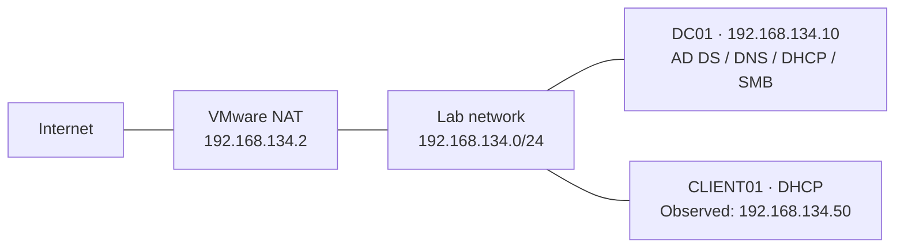
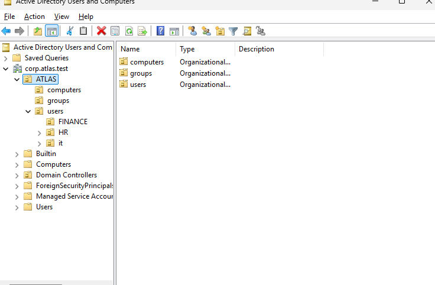
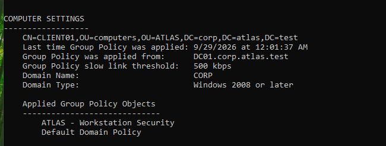
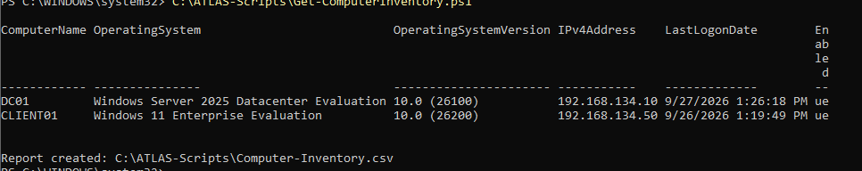

# ATLAS Windows Enterprise Lab

A practical Windows infrastructure and security lab built with Windows Server 2025 and Windows 11 Enterprise. The project demonstrates domain administration, network services, access control, PowerShell reporting, and structured troubleshooting in a small corporate environment.

## Environment

| System | Platform / role | Address |
| --- | --- | --- |
| DC01 | Windows Server 2025 Datacenter Evaluation; AD DS, DNS, DHCP, SMB | `192.168.134.10` (static) |
| CLIENT01 | Windows 11 Enterprise Evaluation; domain workstation | DHCP; `192.168.134.50` in the captured lab |
| VMware NAT gateway | Outbound network access | `192.168.134.2` |

**Domain:** `corp.atlas.test` · **NetBIOS:** `CORP` · **Subnet:** `192.168.134.0/24`



This is a single-server learning environment. Hosting identity and file services on one domain controller keeps the lab compact but creates a shared failure point. See [architecture and design limits](docs/architecture.md).

## Documentation

| Guide | Coverage |
| --- | --- |
| [Architecture](docs/architecture.md) | Systems, network, service dependencies, and evidence scope |
| [Active Directory](docs/active-directory.md) | OU structure, security groups, account lifecycle, and automation |
| [DNS and DHCP](docs/dns-dhcp.md) | Internal name resolution, DHCP options, and validation |
| [Group Policy](docs/group-policy.md) | Workstation policy, computer scope, and user drive mapping |
| [File services](docs/file-services.md) | SMB shares, AGDLP, effective access, and drive letters |
| [Security hardening](docs/hardening.md) | Least privilege, firewall, logging, and event analysis |
| [Troubleshooting](docs/troubleshooting.md) | Four failure scenarios, diagnosis, recovery, and lessons |

## What the lab demonstrates

- An `ATLAS` OU hierarchy for departmental users, computers, and groups.
- Global and domain local security groups following an AGDLP-style access model.
- A domain-joined workstation using DC01 for DNS and DHCP.
- A workstation GPO linked to `ATLAS/computers` and visible in client policy results.
- Departmental SMB shares and group-based access, with Group Policy Preferences drive mapping described in the lab notes.
- Separate standard and administrative accounts, an offboarding exercise, and authentication auditing.
- PowerShell scripts for directory reports, group membership, failed logons, inventory, and CSV-based user creation.

## Selected evidence

The screenshots capture the completed lab. The guides distinguish visible evidence from configuration reported in the lab notes; they also include commands for future verification. Those commands were not run against the virtual machines during repository preparation.

### Directory structure



### Applied workstation policy



### PowerShell inventory



| Evidence | What it shows |
| --- | --- |
| [01 — Directory structure](screenshots/01-active-directory-structure.png) | ATLAS OUs and department layout |
| [02 — Security groups](screenshots/02-security-groups.png.png) | Group names and scopes |
| [03 — Domain client](screenshots/03-domain-client.png.png) | CLIENT01 membership in `corp.atlas.test` |
| [04 — DNS forward zone](screenshots/04-dns-forward-zone.png.png) | Domain zone and host records |
| [05 — DHCP lease](screenshots/05-dhcp-lease.png.png) | ATLAS-LAN lease for CLIENT01 |
| [06 — Workstation GPO](screenshots/06-gpo-workstation-security.png.png) | Enabled policy link on the computers OU |
| [07 — Policy results](screenshots/07-gpresult.png.png) | Client OU and applied computer GPOs |
| [08 — File shares](screenshots/08-file-shares.png.png) | Departmental shares and local paths |
| [09 — Automation](screenshots/09-powershell-automation.png.png) | Computer inventory script output |
| [10 — Failed logon](screenshots/10-failed-logon-event.png.png) | Security event 4625 on CLIENT01 |

The original screenshot filenames, including the existing `.png.png` suffixes, are retained.

## PowerShell automation

| Script | Behavior / output in `C:\ATLAS-Scripts` |
| --- | --- |
| [Get-ADUserReport.ps1](scripts/Get-ADUserReport.ps1) | Directory user properties → `AD-User-Report.csv` |
| [Get-GroupMembership.ps1](scripts/Get-GroupMembership.ps1) | Direct members of the seven lab groups → `Group-Membership-Report.csv` |
| [Get-ComputerInventory.ps1](scripts/Get-ComputerInventory.ps1) | Directory computer inventory → `Computer-Inventory.csv` |
| [Get-FailedLogons.ps1](scripts/Get-FailedLogons.ps1) | Prompts for credentials; reads CLIENT01 Security event 4625 → `Failed-Logon-Report.csv` |
| [New-ATLASUsers.ps1](scripts/New-ATLASUsers.ps1) | Reads `users.csv`, creates users, and adds department group membership |

### Running the existing scripts

Use Windows PowerShell on DC01 or a domain management machine with the Active Directory module and appropriate permissions. The scripts contain fixed lab names and paths. Create `C:\ATLAS-Scripts` on that lab machine before running reports; the scripts do not create the output directory.

For user provisioning, copy [data/users.csv](data/users.csv) to `C:\ATLAS-Scripts\users.csv`. Its columns are `FirstName,LastName,Username,Department,Group`; the department OUs and target groups must already exist. The script prompts securely for an initial password and requires a password change at next logon. It changes Active Directory and skips existing usernames; it does not repair existing users or roll back a user if subsequent group assignment fails.

The failed-logon script needs permission to read the remote Security log and working Remote Event Log Management connectivity. It queries all retained matching events without a time limit. The group report lists direct membership, so nested users need a separate recursive query. Inventory data comes from Active Directory and is not a live endpoint health scan.

The five scripts are preserved as supplied. Repository preparation checked syntax without executing them against the lab.

## Troubleshooting exercises

| Scenario | Diagnosed cause | Recorded recovery |
| --- | --- | --- |
| Domain names fail while IP connectivity works | CLIENT01 uses public DNS `8.8.8.8` | Restore DC01 as DNS server |
| Finance share returns access denied | Finance user removed from `GG-FINANCE` | Restore group membership and refresh the user session |
| Workstation GPO disappears from results | CLIENT01 moved to the default Computers container | Return computer to `ATLAS/computers` and refresh policy |
| Client receives an APIPA address | DC01 DHCP service stopped and no usable client lease | Restart DHCP and renew the client lease |

See the [troubleshooting guide](docs/troubleshooting.md) for the reported outcomes and repeatable verification steps.

## Repository structure

```text
atlas-windows-enterprise-lab/
├── README.md
├── .gitignore
├── .gitattributes
├── data/
│   └── users.csv
├── docs/
│   ├── architecture.md
│   ├── active-directory.md
│   ├── dns-dhcp.md
│   ├── group-policy.md
│   ├── file-services.md
│   ├── hardening.md
│   └── troubleshooting.md
├── scripts/                 # Five original PowerShell scripts
└── screenshots/             # Ten original evidence images
```

Generated reports, raw log exports, local transcripts, and virtual machine images are excluded by `.gitignore`. The CSV contains the three lab input accounts; it does not contain passwords.

## Scope and next steps

The repository documents an existing lab; it is not a complete deployment package. It does not contain VM disks, GPO backups, ACL exports, or an automated rebuild of all services. Redundancy, tested backup restoration, centralized log retention, and more detailed evidence of policy settings are future extensions rather than completed claims.
