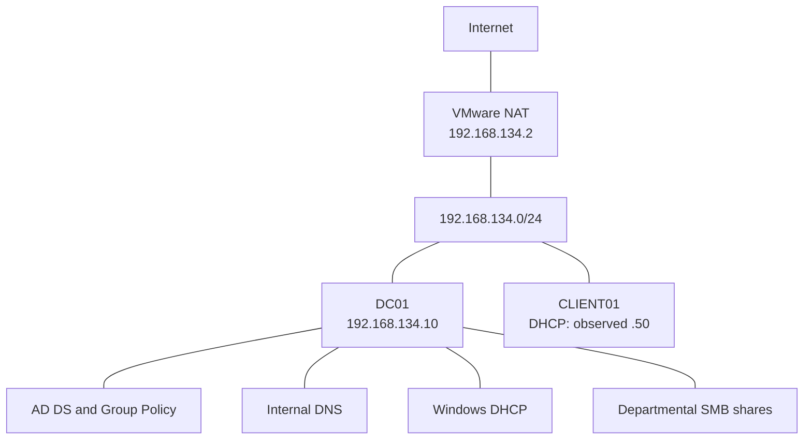

# Architecture

[Back to README](../README.md)

## Purpose and topology

ATLAS models a small Windows domain for practicing identity management, network services, endpoint policy, file permissions, automation, and fault diagnosis. Both virtual machines use the same VMware NAT network.

| Component | Configuration | Function |
| --- | --- | --- |
| Domain | `corp.atlas.test`; NetBIOS `CORP` | Central identity and policy boundary |
| Lab subnet | `192.168.134.0/24` | Server and workstation connectivity |
| DC01 | `192.168.134.10`, static | AD DS, DNS, DHCP, SMB file services |
| CLIENT01 | DHCP; observed `192.168.134.50` | Domain workstation and validation endpoint |
| NAT gateway | `192.168.134.2` | Outbound access from the lab |

The [inventory evidence](../screenshots/09-powershell-automation.png.png) identifies Windows Server 2025 Datacenter Evaluation on DC01 and Windows 11 Enterprise Evaluation on CLIENT01. The client address is a captured lease, not evidence of a DHCP reservation.

The diagram shows connectivity and service placement, not firewall rules or packet direction.

## Service dependencies

1. CLIENT01 obtains its address, gateway, DNS server, and DNS suffix from Windows DHCP.
2. The client queries DC01 for internal DNS and domain controller discovery.
3. Active Directory provides authentication and group membership. The workstation computer account belongs to `OU=computers,OU=ATLAS,DC=corp,DC=atlas,DC=test`.
4. Group Policy supplies workstation configuration; user policy handles mapped drives.
5. SMB uses domain identities and group-based permissions to control access to departmental files.

VMware DHCP was disabled in the recorded configuration while VMware NAT stayed enabled. Windows DHCP is the intended lease provider on this virtual network. NAT provides outbound connectivity; it does not replace the endpoint firewall or separate the two lab guests from one another.

## Design choices and limitations

DC01 combines several roles to fit a small lab. A DC01 outage therefore affects identity, internal DNS, new DHCP leases, and file services at the same time. Cached sign-in or an existing client lease may temporarily mask part of that outage.

The captured environment has one domain controller and one workstation. High availability, a separate file server, recovery testing, and centralized monitoring are not demonstrated. VM CPU, memory, disk sizing, exact DHCP pool boundaries, and hypervisor version were not captured and are not inferred here.

## Evidence and verification scope

The documentation uses the original screenshots, the five supplied scripts, the input CSV, and the completed lab notes. Screenshots directly support the OU layout, group scopes, domain membership, forward DNS records, DHCP lease, GPO link/application, share paths, inventory, and one failed-logon event.

Reverse DNS, exact GPO settings, group nesting, effective file permissions, drive targeting, and account lifecycle actions are described in the lab notes but are not fully displayed in the retained images. The relevant guides include commands to inspect them again. Repository preparation did not contact the VMs or re-run the troubleshooting exercises.

Continue with [Active Directory](active-directory.md), [DNS and DHCP](dns-dhcp.md), or the [failure scenarios](troubleshooting.md).
