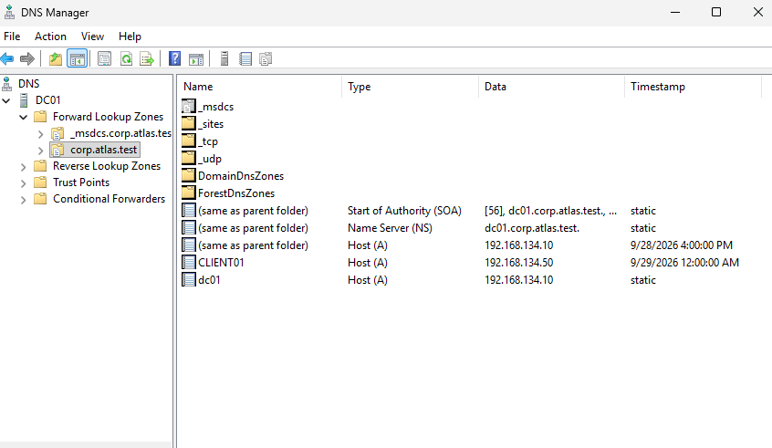

# DNS and DHCP

[Back to README](../README.md)

## Internal DNS

DC01 at `192.168.134.10` serves the internal `corp.atlas.test` namespace. CLIENT01 uses this server for domain name resolution.

| Name in the captured forward zone | Type | Address |
| --- | --- | --- |
| `corp.atlas.test` (zone apex) | A | `192.168.134.10` |
| `dc01.corp.atlas.test` | A | `192.168.134.10` |
| `CLIENT01.corp.atlas.test` | A | `192.168.134.50` |



The screenshot also shows the domain service record folders. The lab notes report that reverse lookup was configured and tested; the reverse zone and PTR records are not expanded in the retained image. DNS forwarder addresses were not recorded.

Use the AD DNS server on domain clients. The DNS failure exercise demonstrated that public DNS `8.8.8.8` did not resolve the private lab domain even while IP connectivity worked. External resolution should be checked through DC01 rather than replacing the client resolver with public DNS.

## DHCP configuration

| Setting | Recorded value |
| --- | --- |
| Server | `DC01` / `192.168.134.10` |
| Scope name | `ATLAS-LAN` |
| Scope ID / subnet mask | `192.168.134.0` / `255.255.255.0` |
| Router option (003) | `192.168.134.2` |
| DNS servers option (006) | `192.168.134.10` |
| DNS domain option (015) | `corp.atlas.test` |
| Captured client lease | `CLIENT01` → `192.168.134.50` |

VMware DHCP was disabled while NAT remained enabled, leaving Windows DHCP as the intended provider of lab leases. The [DHCP screenshot](../screenshots/05-dhcp-lease.png.png) confirms the scope name and client lease. It does not show scope options, lease duration, exclusions, reservations, or the start/end of the allocation pool. Those values should not be inferred from a single lease.

## Validation on CLIENT01

These commands inspect configuration without changing it:

```powershell
ipconfig /all
Resolve-DnsName dc01.corp.atlas.test -Server 192.168.134.10
Resolve-DnsName CLIENT01.corp.atlas.test -Server 192.168.134.10
Resolve-DnsName -Name '_ldap._tcp.dc._msdcs.corp.atlas.test' -Type SRV -Server 192.168.134.10
Resolve-DnsName 192.168.134.10 -Server 192.168.134.10
```

Check the DHCP server, resolver, gateway, and suffix in `ipconfig /all`. The expected captured address is `.50`, but a later valid lease may differ. Confirm host resolution, domain service discovery, and the reverse record independently.

## Validation on DC01

With the DNS Server and DHCP Server management modules available and suitable permissions:

```powershell
Get-DnsServerZone
Get-DnsServerResourceRecord -ZoneName 'corp.atlas.test' -RRType A
Get-DhcpServerInDC
Get-DhcpServerv4Scope
Get-DhcpServerv4OptionValue -ScopeId 192.168.134.0 -All
Get-DhcpServerv4OptionValue -All
Get-DhcpServerv4Lease -ScopeId 192.168.134.0
Get-Service DHCPServer
```

Review scope and server options together because a scope can inherit server-level settings. Check authorization, service state, and the active scope when diagnosing lease failures.

In the controlled DHCP outage, the client reached an APIPA address (`169.254.x.x`) and recovered after the service restarted and its lease was renewed. A stopped DHCP service does not immediately invalidate an existing usable lease. See [the DNS and DHCP failure cases](troubleshooting.md).
