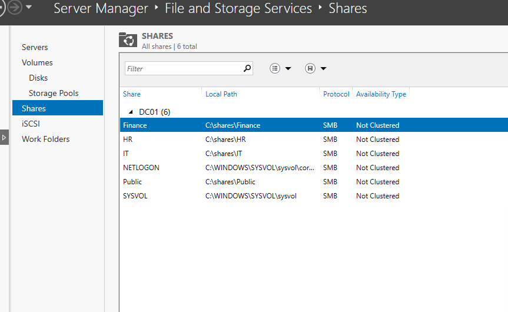

# File Services

[Back to README](../README.md)

## Shares and storage

DC01 provides four departmental/shared SMB resources. The local paths below are visible in the retained server screenshot.

| Share | Local path on DC01 | Resource group | Reported drive letter |
| --- | --- | --- | --- |
| `\\DC01\IT` | `C:\shares\IT` | `DL_IT_Modify` | `I:` |
| `\\DC01\HR` | `C:\shares\HR` | `DL_HR_Modify` | `H:` |
| `\\DC01\Finance` | `C:\shares\Finance` | `DL_FINANCE_Modify` | `F:` |
| `\\DC01\Public` | `C:\shares\Public` | `DL_Public_Modify` | `P:` |



The same view includes `NETLOGON` and `SYSVOL`, which support the domain and are separate from the four lab file shares.

## Permission design

The lab notes describe department users receiving Modify access through nested groups. The Finance example is:

```text
Omar Hassan
  → GG-FINANCE                (Global security group)
  → DL_FINANCE_Modify         (Domain local security group)
  → \\DC01\Finance             (Resource permissions)
```

The group names and scopes are visible in [directory evidence](../screenshots/02-security-groups.png.png). The screenshots do not show the actual ACL entries or nesting, so exact share rights, inheritance settings, explicit denies, and Public membership are not asserted here.

Access over SMB must be permitted by both share permissions and NTFS permissions. `Modify` is an NTFS right; the share-level labels are Read, Change, and Full. To validate the intended access, inspect both permission layers and the user's group token. Do not treat the group's `_Modify` suffix as proof of its permissions.

## Inspect the server configuration

Run on DC01 with appropriate administrative access:

```powershell
Get-SmbShare -Name IT, HR, Finance, Public |
    Select-Object Name, Path, Description
Get-SmbShareAccess -Name Finance
(Get-Acl -LiteralPath 'C:\shares\Finance').Access |
    Format-Table IdentityReference, FileSystemRights, AccessControlType, IsInherited
Get-ADGroupMember -Identity 'DL_FINANCE_Modify'
Get-ADGroupMember -Identity 'DL_FINANCE_Modify' -Recursive
```

Repeat permission inspection for each share. Review administrative and inherited entries as well as the department group.

## Validate as a standard user

Use the intended department account on CLIENT01, not an administrator whose broader rights could hide a mistake.

1. Sign in with a fresh session after a membership change and inspect `whoami /groups`.
2. Open the department UNC path directly before diagnosing its mapped drive.
3. In a dedicated test folder, verify the intended read, create, edit, and delete operations using only disposable files.
4. Verify that a user without the department membership cannot access a restricted department share.
5. Check `net use` and user policy results for the expected drive mappings.

These are repeatable acceptance checks. The recorded Finance exercise demonstrated access denial after removing the user from `GG-FINANCE` and restored access after membership was reinstated. A complete four-share access matrix was not included in the retained evidence.

## Drive maps and session state

Group Policy Preferences provides the reported `I:`, `H:`, `F:`, and `P:` mappings. Departmental item-level targeting selects the relevant users. Mapping a drive does not grant access, and hiding a mapping does not revoke permission to its UNC path.

After changing group membership, use a new user sign-in and a new SMB session before evaluating effective access. Existing tokens and connections can otherwise show the previous state. See [user policy scope](group-policy.md) and [the Finance access case](troubleshooting.md).
