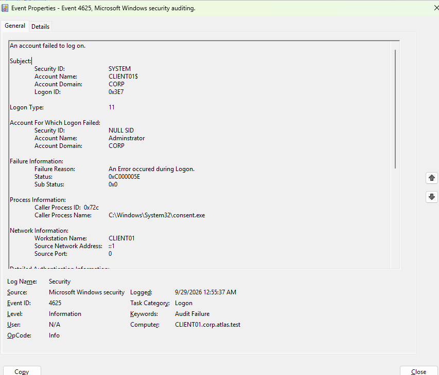

# Security Hardening and Auditing

[Back to README](../README.md)

## Implemented lab controls and evidence

| Control described in the lab | Purpose | Retained evidence |
| --- | --- | --- |
| Separate `seyed` and `adm.seyed` accounts | Separate daily work from domain administration | Lab notes; membership should be rechecked |
| Disabled `former.employee` | Demonstrate account offboarding | Lab notes; account state should be rechecked |
| Group-based departmental permissions | Manage access through role and resource groups | Group names/scopes and shares are pictured; ACLs are not |
| Firewall enabled on all three profiles | Apply host-level network filtering | Workstation GPO application is pictured; individual settings are not |
| Guest disabled | Remove Guest access | Lab notes |
| Logon auditing | Investigate authentication events | Event 4625 captured on CLIENT01 |
| PowerShell logging and transcription | Record administrative activity | Lab notes; sample events/transcripts are not retained |
| Remote Event Log Management rules | Support authorized event collection | Lab notes and the supplied collection script |

These controls describe the training environment. The evidence is not a full security baseline assessment.

## Privilege separation and offboarding

The recorded design keeps the standard `seyed` account outside Domain Admins and uses `adm.seyed` for privileged administration. This describes those two accounts, not an assertion that the administrative account is the only member of Domain Admins.

The disabled `former.employee` account demonstrates a lifecycle action. A broader offboarding process would also examine active sessions, delegated access, group membership, and owned resources. No complete session-revocation workflow is claimed.

The [Active Directory guide](active-directory.md) includes read-only checks for privileged membership and the disabled account.

## PowerShell telemetry

Script Block Logging, Module Logging, and Transcription were described as enabled through workstation policy. For Windows PowerShell, script block events use ID `4104` in `Microsoft-Windows-PowerShell/Operational`. Transcripts are separate files. See [Microsoft's Windows PowerShell logging reference](https://learn.microsoft.com/en-us/powershell/module/microsoft.powershell.core/about/about_logging?view=powershell-5.1).

On CLIENT01, inspect recent script block events after running a harmless command in a new Windows PowerShell session:

```powershell
Get-WinEvent -FilterHashtable @{
    LogName = 'Microsoft-Windows-PowerShell/Operational'
    Id = 4104
} -MaxEvents 5 | Select-Object TimeCreated, Id, Message
```

Inspect the actual module selection and transcription destination in the policy settings. Their values are not recorded in this repository. Treat transcripts and raw event exports as local operational data; generated exports are excluded from version control.

## Authentication event analysis



The retained event provides these concrete fields:

| Field | Captured value |
| --- | --- |
| Event / computer | `4625` / `CLIENT01.corp.atlas.test` |
| Target account | `CORP\Administrator` |
| Logon type | `11` |
| Status / substatus | `0xC000005E` / `0x0` |
| Caller process | `C:\Windows\System32\consent.exe` |
| Source network address | `::1` |

Microsoft identifies type 11 as cached interactive logon, `::1` as localhost, and `0xC000005E` as unavailable logon servers. This makes domain-service availability a relevant investigation path; the screenshot alone does not establish the underlying cause or prove an incorrect password or attack. See the [Microsoft event 4625 field reference](https://learn.microsoft.com/en-us/previous-versions/windows/it-pro/windows-10/security/threat-protection/auditing/event-4625).

[Get-FailedLogons.ps1](../scripts/Get-FailedLogons.ps1) queries CLIENT01 with prompted credentials and exports account, logon type, status, substatus, workstation, and source address. It uses named XML fields rather than fixed property positions. It has no time filter and writes to `C:\ATLAS-Scripts\Failed-Logon-Report.csv`; the directory must already exist.

## Remaining engineering work

The lab has no retained evidence of redundant domain services, a tested recovery plan, centralized event retention, a comprehensive patch baseline, or a complete GPO/ACL export. Suitable extensions are a separate file server, recovery testing, and evidence of each effective security setting. These are future tasks, not completed controls.
